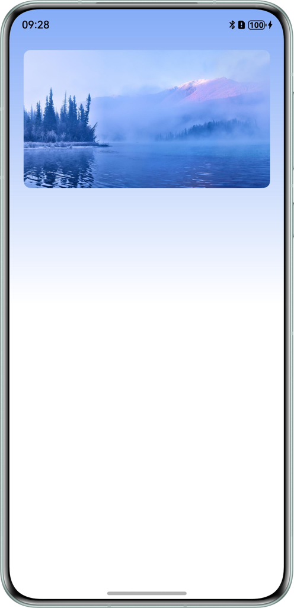
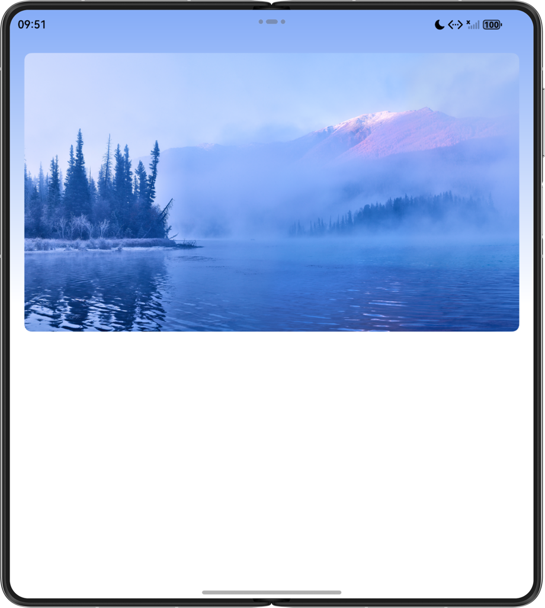
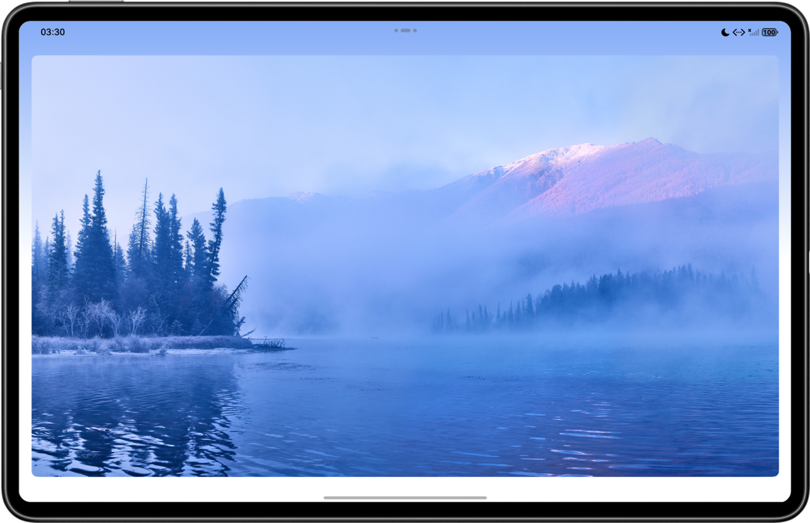

# Adaptive Background Color Using ColorPicker

### Overview

This sample demonstrates how to use the image library and ColorPicker in the EffectKit library to pick the color of the
target image, apply the obtained color as the background gradient color, and use the Swiper component to rotate images.
With this sample, you can skillfully use the ColorPicker APIs and set automatic image rotation.

### Preview

| Bar-Type Phone                             | Foldable                                   | Tablet                                     |           
|--------------------------------------------|--------------------------------------------|--------------------------------------------|
|  |  |  |

**How to Use**

Go to the page and swipe left or right on the image, or wait for 2 seconds until the image is automatically rotated. The
background color automatically changes after the image is switched.

### How to Implement

1. When the onAnimationStart event is triggered to switch the animation, obtain the average color value of the image
   through the Image module, and call ColorPicker in the EffectKit library to obtain the color value.
2. In addition, the animateTo API is called to enable the attribute animation of background color rendering. Enable the
   immersive status bar on the global UI.
3. Set the background color rendering direction and rendering atmosphere through the linearGradient attribute.

### High-Performance Knowledge

N/A

### Project Directory

```
├──entry/src/main/ets                         // ets code 
│  ├──constants 
│  │  └──CommonConstants.ets                  // Common constants   
│  ├──entryability 
│  │  └──EntryAbility.ets 
│  ├──pages                                     
│  │  └──Index.ets                            // Home page 
│  └──utils 
│     ├──Logger.ets                           // Logger class 
│     └──WindowUtil.ets                       // Window utility class 
└──entry/src/main/resources                   // Application resources
```

### Module Dependency

N/A

### See Also

N/A

### Constraints

1. This sample is only supported on devices running standard systems, including bar-type phones, tablets, PCs, bi-fold
   devices, widescreen foldable devices, and tri-fold devices.
2. The HarmonyOS version must be HarmonyOS 6.0.2 Release or later.
3. The DevEco Studio version must be DevEco Studio 6.0.2 Release or later.
4. The HarmonyOS SDK version must be HarmonyOS 6.0.2 Release SDK or later.

